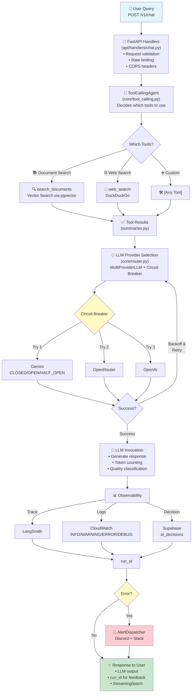
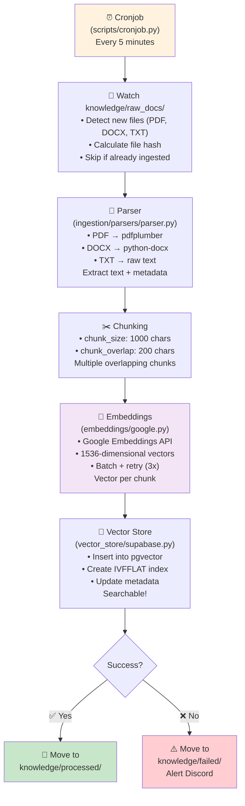
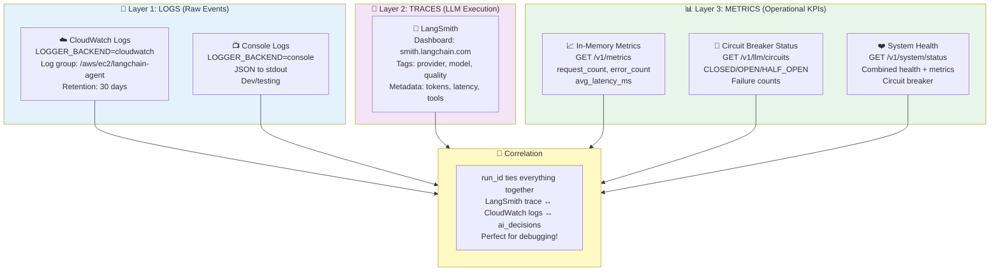
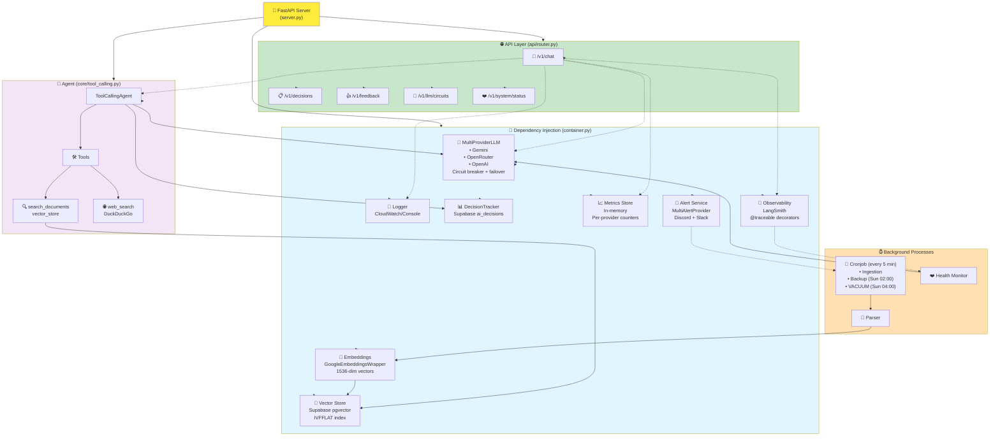

# FW Agent — Architecture Guide

## Tech Stack

| Layer | Technology | Purpose |
|-------|-----------|---------|
| Language | Python 3.11 | Runtime |
| Framework | FastAPI 0.136 | HTTP API |
| Validation | Pydantic 2.13 | Request/response models |
| LLM Orchestration | LangChain 1.3 + LangGraph | Tool-calling agent |
| Database | Supabase + pgvector | Vector store + relational data |
| Migrations | Alembic | Schema versioning |
| Tracing | LangSmith | LLM observability |
| Frontend | Astro + Tailwind v4 | Dashboard UI |
| Alerts | Discord / Slack webhooks | Error notifications |
| Logging | Console (JSON) / CloudWatch | Structured logging |

---

## Architecture Overview

### Request Flow Diagram (Main Loop)



### Document Ingestion Flow (Background Pipeline)



### System Integrations (3-Layer Observability Stack)



### Component Dependency Map



### Composition Root

All services are wired in `container.py`. Change implementations there:

```python
# Example: swap alert provider
alert_service = MultiAlertProvider([DiscordAlertProvider()])

# Example: swap embeddings provider
embeddings = CohereEmbeddingsWrapper(...)

# Example: add new LLM provider
_create_llm_providers() → add AnthropicProvider to list

# Example: add new tool
_create_agent() → add MyCustomTool() to agent_tools
```

---

## Component Breakdown

### Core Agent System

| Component | File | Responsibility |
|-----------|------|-----------------|
| **ToolCallingAgent** | `core/tool_calling.py` | Orchestrates LLM tool selection & execution |
| **Tool Calling Components** | `core/tool_calling_components.py` | Token counting, quality classification, decision metadata extraction |
| **RAGChainAgent** | `core/rag_chain.py` | Legacy: retrieve docs → feed to LLM |
| **Dispatcher** | `core/dispatcher.py` | Routes between agent strategies & alert providers |

### LLM Resilience (Multi-Provider Failover)

| Component | File | Responsibility |
|-----------|------|-----------------|
| **MultiProviderLLM** | `core/router.py` | Circuit breaker logic, provider failover, exponential backoff |
| **GoogleProvider** | `llm/google.py` | Google Gemini integration |
| **OpenRouterProvider** | `llm/openrouter.py` | OpenRouter API (primary) |
| **OpenAIProvider** | `llm/openai.py` | OpenAI GPT fallback |
| **LLMProvider** (base) | `llm/base.py` | Abstract interface + circuit breaker immutable state |

### API Layer (Request Handlers)

| Component | File | Responsibility |
|-----------|------|-----------------|
| **Chat Handler** | `api/handlers/chat.py` | `/v1/chat` & `/v1/chat/stream` endpoints |
| **Decisions Handler** | `api/handlers/decisions.py` | `/v1/decisions` & `/v1/decisions/detail` endpoints |
| **Feedback Handler** | `api/handlers/feedback.py` | `/v1/feedback` endpoint |
| **Circuits Handler** | `api/handlers/circuits.py` | `/v1/llm/circuits` status endpoint |
| **System Handler** | `api/handlers/system.py` | `/v1/system/status` consolidated endpoint |
| **Main Router** | `api/router.py` | Aggregates all handlers + middleware |
| **Error Handling** | `api/global_exception.py` | Global exception handler + structured error responses |
| **Middleware** | `api/middleware.py` | Rate limiting, correlation IDs, logging |
| **Metrics Store** | `api/metrics_store.py` | In-memory metric tracking |

### Tools & Search

| Component | File | Responsibility |
|-----------|------|-----------------|
| **Document Search** | `tools/search_documents.py` | Vector search via pgvector |
| **Web Search** | `tools/web_search.py` | DuckDuckGo integration |
| **Tool Summarizers** | `tools/summaries.py` | Format tool outputs for readability |

### Data & Retrieval

| Component | File | Responsibility |
|-----------|------|-----------------|
| **Retriever** | `retrieval/retriever.py` | Query document chunks, apply filters |
| **Formatting** | `retrieval/formatting.py` | Build SourceDocument objects from chunks |
| **Vector Store** (base) | `vector_store/base.py` | Abstract VectorStore interface |
| **Supabase Store** | `vector_store/supabase.py` | pgvector implementation |

### Observability & Tracking

| Component | File | Responsibility |
|-----------|------|-----------------|
| **DecisionTracker** | `observability/base.py` | In-memory + persistent decision records |
| **DecisionRecorder** | `core/tool_calling_components.py` | Extract + persist decision metadata |
| **LangSmith Provider** | `observability/langsmith.py` | Trace all agent invocations |
| **Decorator** | `observability/decorator.py` | `@trace` decorator for custom tracing |
| **Health Scheduler** | `observability/health/scheduler.py` | Periodic health check runner |
| **Health Checks** | `observability/health/checks.py` | Database, embedding, observability health probes |

### Data Ingestion

| Component | File | Responsibility |
|-----------|------|-----------------|
| **Ingestion Pipeline** | `ingestion/pipeline.py` | Document → chunks → embeddings → store |
| **Document Parser** | `ingestion/parsers/parser.py` | Multi-format (PDF, DOCX, TXT) support |
| **Google Embeddings** | `embeddings/google.py` | Embedding API wrapper |

### Alerts

| Component | File | Responsibility |
|-----------|------|-----------------|
| **Discord Alert** | `alerts/discord.py` | Discord webhook integration |
| **Slack Alert** | `alerts/slack.py` | Slack webhook integration |
| **Alert Base** | `alerts/base.py` | Abstract alert provider interface |
| **MultiAlertProvider** | `core/dispatcher.py` | Fan out alerts to all configured channels |

### Logging

| Component | File | Responsibility |
|-----------|------|-----------------|
| **Logger Factory** | `loggers/__init__.py` | Build logger (console or CloudWatch) |
| **Console Backend** | `loggers/console.py` | JSON logging to stdout |
| **CloudWatch Backend** | `loggers/cloudwatch.py` | AWS CloudWatch Logs integration |

### Models & Configuration

| Component | File | Responsibility |
|-----------|------|-----------------|
| **Chat Models** | `models/chat.py` | ChatRequest, ChatResponse |
| **Document Models** | `models/document.py` | DocumentMetadata, DocumentChunk |
| **Observability Models** | `models/observability/decisions.py` | DecisionLogEntry, DecisionMetricsResponse, etc. |
| **Response Models** | `models/responses.py` | CircuitStatusResponse, SystemStatusResponse, etc. |
| **Settings** | `config/settings.py` | Pydantic environment config |
| **Constants** | `config/constants.py` | Truncation limits, thresholds |
| **Prompts** | `config/prompts.py` | System prompts, tool descriptions |

### Infrastructure

| Component | File | Responsibility |
|-----------|------|-----------------|
| **Container** | `container.py` | Dependency injection + service wiring |
| **Server Entry Point** | `server.py` | FastAPI app creation + startup/shutdown |
| **Shared Utils** | `shared/exceptions.py`, `shared/correlation.py` | Correlation IDs, exception hierarchy |

---

## Architecture Decisions

### 1. **Tool Calling vs RAG Chain**

- **Tool Calling** (default): LLM decides which tools to use (intelligent routing)
- **RAG Chain** (legacy): Always retrieve documents first, then generate

Strategy pattern allows swapping via `container.py` configuration.

### 2. **Multi-Provider LLM with Circuit Breaker**

Prevents cascading failures:
- Google → OpenRouter → OpenAI (tried in order)
- Each provider has circuit breaker (closed → open on 3 failures → half-open after 60s)
- On transient error: exponential backoff (1s base, 30s max, with jitter)
- On permanent error: skip directly to next provider

### 3. **Decision Recording on Every Invocation**

Every chat request is recorded to `ai_decisions` table with:
- Full metadata (model used, tools chosen, latency, quality classification)
- User feedback correlation (can be added after-the-fact)
- Enables continuous improvement + audit trail

### 4. **In-Memory Metrics (Fast) + Persistent Decisions (Audit)**

- **Metrics**: Request count, error count, token usage — in-memory, reset on restart
- **Decisions**: Full invocation records — persisted to Supabase immediately

Metrics for operational dashboards (real-time), decisions for analytics.

### 5. **Composition Root Pattern**

All services are wired in `container.py` — single source of truth for:
- Which agent strategy is active
- Which LLM providers are configured
- Which tools are available
- Which alert channels are active

Enables testing (swap implementations) + feature flags (enable/disable tools).

---


### Architecture

Multi-provider failover with circuit breakers, defined in `core/router.py`:

```
MultiProviderLLM
  ├── GoogleProvider    (gemini-2.5-flash)
  ├── OpenAIProvider    (gpt-4o-mini)
  └── OpenRouterProvider (google/gemma-4-31b-it:free)
```

### How failover works

1. Providers are tried **in order** (Google → OpenRouter → OpenAI)
2. Each has a **circuit breaker** (closed → open on 3 failures → half-open after 60s)
3. On transient errors, next provider is tried with **exponential backoff** (1s base, 30s max)
4. If all providers fail → `AllProvidersExhaustedError`

### Adding a new provider

1. Create `llm/anthropic.py` extending `LLMProvider`
2. Implement `chat_model` property + `is_configured()` + `invoke()`
3. Add to `_create_llm_providers()` in `container.py`
4. Circuit breaker + failover are automatic

### Circuit breaker states

| State | Meaning | Next action |
|-------|---------|-------------|
| `closed` | Working normally | Requests pass through |
| `open` | Failing, blocked | Requests rejected, timer counts down |
| `half_open` | Probing | One request allowed; success → closed, failure → open |

View current states: `GET /v1/llm/circuits` or the **Health** page in the UI.

---

## Tools

Tools are injected into the agent at construction time. The container (`container.py` → `_create_agent()`) decides which tools to activate. Each tool extends LangChain's `BaseTool`.

| Tool | File | Description |
|------|------|-------------|
| `search_documents` | `tools/search_documents.py` | Vector search over ingested documents via Supabase pgvector |
| `web_search` | `tools/web_search.py` | DuckDuckGo web search (alternative to document search) |

### Tool Execution Flow

1. **Tool Selection**: `ToolCallingAgent` asks LLM which tool(s) to use
2. **Execution**: Selected tool is invoked with formatted parameters
3. **Result Formatting**: `tools/summaries.py` formats tool output for human readability
4. **Token Counting**: `DecisionMetadataExtractor` tracks tokens consumed per tool
5. **Decision Recording**: `DecisionRecorder` captures tool call sequence + reasoning

### Adding a New Tool

1. Create a class extending `BaseTool` in `tools/{name}.py`
2. Implement `_run()` and `_arun()` methods
3. Register in `container.py` → `_create_agent()` → `agent_tools` list
4. Add summarizer to `tools/summaries.py` for result formatting

---

## Decision Tracking

The system records detailed metadata about every LLM invocation for audit, analysis, and continuous improvement.

### What is Recorded

Every agent invocation generates a `DecisionLogEntry` persisted to Supabase `ai_decisions` table:

| Field | Type | Description |
|-------|------|-------------|
| `run_id` | TEXT PK | LangSmith trace ID for correlation |
| `query_preview` | TEXT | First 200 chars of user query |
| `query_hash` | TEXT | SHA-256 of full query (deduplication) |
| `agent_type` | TEXT | `tool_calling` or `rag_chain` (legacy) |
| `model_used` | TEXT | LLM provider that responded (google / openrouter / openai) |
| `decision_quality` | TEXT | `optimal` / `suboptimal` / `poor` |
| `tools_used` | JSONB | Ordered list of tool names |
| `chain_length` | INT | Number of sequential tool calls |
| `chain_tools` | JSONB | Detailed tool invocation records with input/output |
| `latency_ms` | FLOAT | End-to-end execution time |
| `reasoning_summary` | TEXT | Concise AI reasoning for tool selection |
| `tool_selection_rationale` | TEXT | Raw LLM reasoning (up to 2000 chars) |
| `temperature` | FLOAT | LLM temperature at request time |
| `top_k` | INT | Number of documents retrieved (if using search_documents) |
| `user_feedback` | JSONB | User like/dislike + comment (if provided) |
| `timestamp` | TIMESTAMPTZ | When decision was made |

### Decision Quality Classification

**Algorithm** (in `core/tool_calling_components.py` → `DecisionQualityClassifier`):

- **optimal**: Right tool for the query (e.g., search for factual questions)
- **suboptimal**: Tool used but suboptimal alternative existed
- **poor**: Wrong tool or unnecessary tool chain

Triggers are stored in `config/prompts.py` and can be adjusted for domain-specific classification.

### Storage & Retrieval

**In-Memory**:
- `_DecisionStore` (deque, max 10,000 entries) for fast queries
- Resets on server restart

**Persistent**:
- Supabase `ai_decisions` table, immediate write on each record
- Full query history available for analytics

### API Endpoints

| Endpoint | Method | Description |
|----------|--------|-------------|
| `/v1/decisions` | GET | List decisions with filtering & pagination |
| `/v1/decisions/detail` | GET | Retrieve single decision by `run_id` |
| `/v1/feedback` | POST | Record user feedback (like/dislike) |

**Decision List Example**:
```
GET /v1/decisions?quality=optimal&from=2026-06-01&to=2026-06-05&page=1&per_page=20
```

Returns aggregates (avg latency, tool distribution, quality counts) + paginated records.

**Decision Detail Example**:
```
GET /v1/decisions/detail?run_id=<trace_id>
```

Returns full `DecisionLogEntry` including full `tool_selection_rationale` and `chain_tools` details.

### Frontend Integration

- **Dashboard** (`ui/src/pages/dashboard.astro`): Displays circuit breaker health + metrics
- **Decisions page** (`ui/src/pages/decisions/index.astro`): Table of decisions with filters
- **Decision detail** (`ui/src/pages/decisions/detail.astro`): Full metadata view + feedback form

---

## Metrics

### What is tracked (in-memory, resets on restart)

| Metric | Source | Description |
|--------|--------|-------------|
| `request_count` | `chat.py` | Total chat requests since startup |
| `error_count` | `chat.py` | Failed requests |
| `avg_latency_ms` | `chat.py` | Average response time |
| `total_input_tokens` | `chat.py` | Total prompt tokens |
| `total_output_tokens` | `chat.py` | Total completion tokens |

Endpoint: `GET /v1/system/status` (includes health + metrics + circuits).

---

## Health Monitoring

### Single consolidated endpoint

```
GET /v1/system/status
```

Returns:
```json
{
  "status": "ok",
  "db_connected": true,
  "llm_connected": true,
  "embedding_connected": true,
  "circuits": {
    "google": "closed",
    "openai": "closed",
    "openrouter": "closed"
  },
  "request_count": 42,
  "error_count": 2,
  "avg_latency_ms": 1234.5,
  "total_input_tokens": 15000,
  "total_output_tokens": 32000
}
```

### Background scheduler

`MonitoringScheduler` (`observability/health/scheduler.py`) runs periodic health checks on a configurable interval. Results feed into the sled mechanism for traffic shedding.

---

## Streaming Chat Endpoint

Real-time response streaming for long-running agent operations.

### Endpoint

```
POST /v1/chat/stream
Content-Type: application/json

{
  "query": "What is the enrollment process?",
  "top_k": 5,
  "include_sources": true,
  "temperature": 0.7
}
```

### Response Format

Returns `text/event-stream` with Server-Sent Events (SSE):

```
data: {"type": "delta", "content": "The "}
data: {"type": "delta", "content": "enrollment "}
data: {"type": "delta", "content": "process..."}
data: {"type": "done", "response": {...full response object...}}
```

Use for:
- Browser streaming UI (progressive text rendering)
- Reduced perceived latency
- Cancellation support (close connection to stop generation)

---

## Ingestion Pipeline

Documents are ingested, chunked, embedded, and stored in the vector database for retrieval.

### Architecture

```
Raw Document (PDF/DOCX/TXT)
    ↓
├─ Parser (pdfplumber / python-docx / plain text)
    ↓
├─ Chunker (semantic split on sentence boundaries, max 1000 chars/chunk)
    ↓
├─ Embedder (Google Embeddings API, 1536-d vectors)
    ↓
└─ VectorStore (Supabase pgvector, IVFFLAT index)
```

### Files

| File | Purpose |
|------|---------|
| `ingestion/pipeline.py` | Orchestration + chunking logic |
| `ingestion/parsers/parser.py` | Multi-format document parser |
| `embeddings/google.py` | Google Embeddings wrapper |
| `vector_store/supabase.py` | pgvector insertion + search |
| `scripts/cronjob.py` | Scheduled ingestion job |
| `scripts/backup.py` | Periodic vector store backups |

### Invocation

**Manual ingestion via API** (if endpoint is exposed):
```bash
curl -X POST http://localhost:8000/v1/documents/ingest \
  -F "file=@enrollment.pdf"
```

**Scheduled ingestion**:
```bash
# Run cronjob (cron interval from env: CRON_INTERVAL_MINUTES)
python scripts/cronjob.py
```

### Observability

Ingestion failures trigger `WARNING` severity alerts via Discord/Slack with:
- Document filename
- Error type (parser error, embedding API failure, DB write failure)
- Retry count

---

## Rate Limiting

Per-endpoint rate limiting to prevent abuse.

### Configuration

| Endpoint | Limit | Window | Config |
|----------|-------|--------|--------|
| `/v1/chat` | 100 | 1 minute | `RATE_LIMIT_CHAT` |
| `/v1/decisions` | 500 | 1 minute | `RATE_LIMIT_DECISIONS` |

Implemented via `api/middleware.py` → `RateLimitMiddleware`.

### Behavior

**Rate limit exceeded**:
```json
HTTP/1.1 429 Too Many Requests
{
  "detail": "Rate limit exceeded: 100 requests/minute"
}
```

---

## API Endpoints (Complete Reference)

### Chat Operations

| Endpoint | Method | Description |
|----------|--------|-------------|
| `/v1/chat` | POST | Process query via configured agent (RAG or tool-calling) |
| `/v1/chat/stream` | POST | Streaming response (Server-Sent Events) |

**Request** (`/v1/chat`):
```json
{
  "query": "What is the enrollment process?",
  "top_k": 5,
  "include_sources": true,
  "temperature": 0.7
}
```

**Response**:
```json
{
  "response": "The enrollment process...",
  "sources": [
    {"document": "enrollment.pdf", "chunk_id": 3, "score": 0.92, "content": "..."}
  ],
  "run_id": "trace-uuid",
  "model_used": "google",
  "latency_ms": 1234.5,
  "usage_metadata": {
    "input_tokens": 150,
    "output_tokens": 280
  }
}
```

### System & Health

| Endpoint | Method | Description |
|----------|--------|-------------|
| `/v1/system/status` | GET | Consolidated health + metrics endpoint (combines health checks + metrics; replaces legacy separate endpoints) |

**Response** (`/v1/system/status`):
```json
{
  "status": "ok",
  "timestamp": "2026-06-05T14:30:00Z",
  "db_connected": true,
  "llm_connected": true,
  "embedding_connected": true,
  "circuits": {
    "google": "closed",
    "openrouter": "closed",
    "openai": "closed"
  },
  "request_count": 42,
  "error_count": 2,
  "avg_latency_ms": 1234.5,
  "total_input_tokens": 15000,
  "total_output_tokens": 32000
}
```

### Decision Tracking & Analytics

| Endpoint | Method | Description |
|----------|--------|-------------|
| `/v1/decisions` | GET | List decisions with filters & pagination |
| `/v1/decisions/{run_id}` | GET | Retrieve single decision by `run_id` (path parameter) |
| `/v1/feedback` | POST | Record user feedback (like/dislike) |

**Query Decisions**:
```
GET /v1/decisions?quality=optimal&from=2026-06-01&to=2026-06-05&tool=search_documents&page=1&per_page=20
```

Returns paginated list + aggregates (avg latency, quality distribution, tool usage).

**Decision Detail**:
```
GET /v1/decisions/{run_id}
```

Returns full `DecisionLogEntry` including `chain_tools` array and `tool_selection_rationale`.

**Feedback**:
```
POST /v1/feedback
{
  "run_id": "<trace_id>",
  "feedback_type": "like",
  "comment": "Excellent answer!"
}
```

### LLM Provider Diagnostics

| Endpoint | Method | Description |
|----------|--------|-------------|
| `/v1/llm/circuits` | GET | Circuit breaker status for all providers |

**Response**:
```json
{
  "circuits": {
    "google": "closed",
    "openrouter": "half_open",
    "openai": "closed"
  }
}
```

---

## Alerts

| Provider | File | Config |
|----------|------|--------|
| Discord | `alerts/discord.py` | `DISCORD_WEBHOOK_URL` |
| Slack | `alerts/slack.py` | `SLACK_WEBHOOK_URL` |

### Architecture

`MultiAlertProvider` (`core/dispatcher.py`) fans out alerts to all configured providers. Each provider handles:

- **Rate limiting**: Max 5 alerts/minute (configurable)
- **Deduplication**: Same fingerprint suppresses repeated alerts
- **Severity filtering**: INFO / WARNING / ERROR / CRITICAL

### Adding a new alert provider

1. Create `alerts/teams.py` extending `AlertProviderBase`
2. Implement `is_configured()` + `send_alert()`
3. Add to `_create_alert_providers()` in `container.py`

### When alerts fire

| Trigger | Severity | Source |
|---------|----------|--------|
| Chat validation error | WARNING | `chat.py` |
| LLM provider exhausted | ERROR | `chat.py` |
| Monitoring check failure | WARNING | `health/scheduler.py` |
| Ingestion failure | WARNING | `cronjob.py` |
| Backup failure | ERROR | `backup.py` |
| Unhandled exception | ERROR | `global_exception.py` |

---

## Logging

Two backends available, configured via `LOGGER_BACKEND` environment variable:

| Backend | Output | Use case |
|---------|--------|----------|
| `console` (default) | JSON to stdout | Local dev + Docker |
| `cloudwatch` | AWS CloudWatch Logs | Production (EC2) |

**Usage in code**:
```python
from loggers import logger

logger.info("User query received", extra={"query_length": len(query)})
logger.error("LLM failed", exc_info=error)
```

**Log Levels Captured**:
- **INFO**: Query received, response sent, timing, normal operations
- **WARNING**: API retries, timeouts, degraded modes
- **ERROR**: Exceptions, connection failures, rate limit exhaustion
- **DEBUG**: Detailed API calls, database queries (verbose)

**Logger Factory**: Built in `loggers/__init__.py` → `_build_logger()`

**CloudWatch Integration (Production)**:
- Set `LOGGER_BACKEND=cloudwatch` in `.env`
- Logs ship to CloudWatch log group: `/aws/ec2/langchain-agent`
- Includes correlation IDs for tracing requests through the system
- Log retention: 30 days (configurable in AWS Console)

**Complementary Observability Stack**:
- **CloudWatch Logs**: Raw application logs (INFO, WARNING, ERROR)
- **LangSmith Traces**: Detailed LLM invocations with tokens + latency
- **In-Memory Metrics**: Real-time request count, error rate, latency
- **DecisionTracker**: Persisted decision records in Supabase

All three systems use the same `run_id` / `correlation_id` for correlation.

**See Also**: [EC2 Deployment](#ec2-deployment-with-aws-cloudwatch--langsmith) for full CloudWatch + LangSmith integration details.

---

## Observability (LangSmith)

All agent invocations are traced via `@traceable` decorators and `LangSmithObservabilityProvider` (`observability/langsmith.py`).

**Configuration**:
- Set `LANGSMITH_API_KEY` in `.env` (required to enable tracing)
- Set `LANGSMITH_PROJECT` to your project name (defaults to `langchain-agent`)

**Trace Tags** (for filtering/searching in LangSmith):
- `model:{actual_model_used}` — Which LLM provider responded
- `agent:{tool_calling|rag_chain}` — Agent strategy used
- `decision_quality:{optimal|suboptimal|poor}` — Quality classification
- `chain_length:{N}` — Number of tool calls in sequence
- `tools_used:{tool1,tool2}` — Tool names executed
- `environment:production` — Deployment environment

**What's Tracked**:
- User query (first 200 chars)
- LLM response
- Model used
- Token counts (input + output)
- Execution latency
- All tool calls + their results
- Errors (if any)

**Dashboard Access**: https://smith.langchain.com → Project → Traces by date/model/query

**Correlation with Other Systems**:
- LangSmith trace ID = `run_id` in `ai_decisions` table
- Can search from Discord alerts → LangSmith → CloudWatch logs all using same trace ID

**See Also**: [EC2 Deployment with AWS CloudWatch & LangSmith](#ec2-deployment-with-aws-cloudwatch--langsmith) section for detailed integration with CloudWatch.

---

## Feedback System & User Signals

Users can provide explicit feedback (like/dislike) correlated to any LLM invocation. This feedback feeds into decision quality analysis and improves future iterations.

**Endpoint**: `POST /v1/feedback`

**Request**:
```json
{
  "run_id": "trace-uuid-from-response",
  "feedback_type": "like" or "dislike",
  "comment": "Optional user comment (max 1000 chars)"
}
```

**Response**:
- `200` → Feedback recorded in both LangSmith + Supabase
- `202 Accepted` → LangSmith backend unreachable, feedback stored server-side only

**Data Stored** (Supabase `ai_decisions`):
- `user_feedback.type`: "like" or "dislike"
- `user_feedback.comment`: User comment
- `user_feedback.timestamp`: ISO 8601 timestamp

**Workflow**:
1. User clicks "Like" or "Dislike" on response in UI
2. UI sends feedback to `/v1/feedback` with the `run_id` from the response
3. Server correlates feedback with `DecisionTracker` entry for that run_id
4. Feedback also sent to LangSmith API (if `LANGSMITH_API_KEY` configured)
5. Analytics can query feedback later: `SELECT * FROM ai_decisions WHERE user_feedback->>'type' = 'dislike'`

**Implementation** (`api/handlers/feedback.py`):
```python
@router.post("/feedback")
async def feedback(request: FeedbackRequest, service=Depends(lambda: observability)):
    # Correlate with DecisionTracker
    existing = decision_tracker.get_by_run_id(request.run_id)
    if existing:
        updated = DecisionLogEntry(
            **{**existing.model_dump(), "user_feedback": feedback_payload},
        )
        decision_tracker.record(updated)
    
    # Send to LangSmith (if configured)
    result = service.record_feedback(
        run_id=request.run_id,
        feedback_type=request.feedback_type,
        comment=request.comment,
    )
    return {"status": "recorded"}
```

---

## Pluggable Architecture & Provider Swapping

The system is **designed for swapping implementations** across all major subsystems. Each subsystem has a clear interface; changing a provider requires:
1. Implement the interface
2. Add to `container.py` wiring
3. Done — no other changes needed

### LLM Providers (Multi-Provider Failover)

**Current Providers**:
- Google Gemini (`llm/google.py`)
- OpenRouter (`llm/openrouter.py`)
- OpenAI (`llm/openai.py`)

**Interface** (`llm/base.py`):
```python
class LLMProvider:
    @classmethod
    def is_configured(cls) -> bool:
        """Return True if all required env vars present."""
        ...
    
    @property
    def chat_model(self):
        """Return LangChain ChatModel instance."""
        ...
    
    @property
    def name(self) -> str:
        """Provider name for logging/tagging."""
        ...
```

**To Add a New Provider** (e.g., Anthropic Claude):
1. Create `llm/anthropic.py`:
   ```python
   class AnthropicProvider(LLMProvider):
       def is_configured(self) -> bool:
           return bool(os.getenv("ANTHROPIC_API_KEY"))
       
       @property
       def chat_model(self):
           from langchain_anthropic import ChatAnthropic
           return ChatAnthropic(api_key=os.getenv("ANTHROPIC_API_KEY"))
       
       @property
       def name(self) -> str:
           return "anthropic"
   ```

2. Update `container.py`:
   ```python
   def _create_llm_providers():
       from llm import (
           GoogleProvider,
           OpenRouterProvider,
           OpenAIProvider,
           AnthropicProvider,  # ADD THIS
       )
       return _configured([GoogleProvider, OpenRouterProvider, OpenAIProvider, AnthropicProvider])
   ```

3. Add to `.env`:
   ```
   ANTHROPIC_API_KEY=sk-ant-...
   ```

4. Restart server → Anthropic will be in the failover chain automatically

**Failover Behavior** (automatic via `MultiProviderLLM` in `core/router.py`):
- Tries providers in order: Gemini → OpenRouter → OpenAI → Anthropic
- Skips closed circuit breakers
- Returns result of first successful provider
- If all fail → raises `AllProvidersExhaustedError`

### Embedding Providers

**Current Provider**:
- Google Embeddings (`embeddings/google.py`)

**Interface** (`embeddings/base.py`):
```python
class EmbeddingProvider:
    def embed_query(self, text: str) -> List[float]:
        """Embed a query into a 1536-dimensional vector."""
        ...
    
    def embed_documents(self, texts: List[str]) -> List[List[float]]:
        """Embed multiple documents."""
        ...
```

**To Add Alternative** (e.g., Cohere):
1. Create `embeddings/cohere.py`
2. Update `container.py`:
   ```python
   embeddings = CohereEmbeddingsWrapper(api_key=settings.cohere_api_key)
   ```

**Note**: Currently only one embeddings provider per deployment. To support multi-embeddings, would need to extend vector store schema (store provider name per document).

### Alert Providers (Multi-Channel Fanout)

**Current Providers**:
- Discord (`alerts/discord.py`)
- Slack (`alerts/slack.py`)

**Interface** (`alerts/base.py`):
```python
class AlertProvider(Protocol):
    async def send_alert(
        self,
        severity: Severity,
        message: str,
        error: Optional[Exception] = None,
        metadata: Optional[Dict[str, object]] = None,
    ) -> None:
        """Send one alert through this provider's backend."""
```

**To Add a New Alert Channel** (e.g., Email, PagerDuty):
1. Create `alerts/email.py`:
   ```python
   class EmailAlertProvider:
       async def send_alert(self, severity, message, error=None, metadata=None):
           # Use SMTP to send email
           ...
   ```

2. Update `container.py`:
   ```python
   def _create_alert_providers():
       from alerts import DiscordAlertProvider, SlackAlertProvider, EmailAlertProvider
       from core.dispatcher import MultiAlertProvider
       providers = _configured([DiscordAlertProvider, SlackAlertProvider, EmailAlertProvider])
       return MultiAlertProvider(providers)
   ```

3. Add to `.env`:
   ```
   EMAIL_WEBHOOK_URL=smtp://...
   ```

**Behavior** (via `MultiAlertProvider` in `core/dispatcher.py`):
- Sends alert to ALL configured providers in parallel
- Each provider runs in its own async task
- If one fails, others still receive the alert (isolated failure)
- Failures are logged at `ERROR` level but don't crash the system

### Observability Provider (Tracing Backend)

**Current Provider**:
- LangSmith (`observability/langsmith.py`)

**Interface** (`observability/base.py`):
```python
class ObservabilityProvider(Protocol):
    def record_feedback(
        self,
        run_id: str,
        feedback_type: Literal["like", "dislike"],
        comment: Optional[str] = None,
    ) -> FeedbackResponse:
        """Record user feedback for a trace run."""
        ...
    
    def apply_tags(self, run_id: str, tags: List[str]) -> None:
        """Add tags to an active trace."""
        ...
    
    def apply_metadata(self, run_id: str, metadata: Dict[str, Any]) -> None:
        """Add metadata to an active trace."""
        ...
```

**To Add Alternative** (e.g., Datadog, New Relic):
1. Create `observability/datadog.py`
2. Implement the protocol
3. Update `container.py`:
   ```python
   def _create_observability_provider():
       from observability import set_observability_provider
       from observability.datadog import DatadogObservabilityProvider
       provider = DatadogObservabilityProvider()
       set_observability_provider(provider)
       return provider
   ```

**Note**: `@traceable` decorators throughout the codebase will automatically use the configured provider.

---

## Circuit Breaker Mechanism

The circuit breaker protects against cascading failures when an LLM provider is degraded or down. Each provider gets its own independent circuit breaker with three states.

**States**:
```
CLOSED (normal)
   ↓
   [max_failures reached]
   ↓
OPEN (failing, reject calls)
   ↓
   [recovery_timeout elapsed]
   ↓
HALF_OPEN (probing, allow one call)
   ↓
   [probe succeeds] → CLOSED (recover)
   [probe fails]    → OPEN (re-fail)
```

**Implementation** (`core/router.py`):

```python
@dataclass(frozen=True)
class CircuitBreaker:
    failure_threshold: int = 3          # Open after 3 consecutive failures
    recovery_timeout: float = 60.0      # Wait 60 seconds before probing
    state: CircuitState = CircuitState.CLOSED
    failure_count: int = 0
    opened_at: float = 0.0
```

**Configuration** (from `.env` or defaults):
- `LLM_CIRCUIT_FAILURE_THRESHOLD`: Failures before opening (default: 3)
- `LLM_CIRCUIT_RECOVERY_TIMEOUT`: Seconds to wait before probing (default: 60)

**Behavior**:

1. **CLOSED** (normal operation):
   - All calls go through
   - Failure counter increments on transient error
   - On success → failure counter resets to 0

2. **OPEN** (failing):
   - All calls to this provider are immediately rejected
   - Log: `"Circuit OPEN, skipping {provider} (failures=3/3)"`
   - Failover to next provider automatically

3. **HALF_OPEN** (recovery probe):
   - After `recovery_timeout` seconds, transition to HALF_OPEN automatically
   - Allow ONE call to the provider (probe)
   - If probe succeeds → back to CLOSED (reset failure counter)
   - If probe fails → back to OPEN (re-open, failure_count incremented)

**Example Failure Sequence**:
```
T=0s    Gemini fails (1/3)              [CLOSED]
T=2s    Gemini fails (2/3)              [CLOSED]
T=4s    Gemini fails (3/3)              [OPEN] — circuit opens, log warning
T=4s    User query → tries Gemini? No → SKIP (circuit open, skip to OpenRouter)
T=60s   Automatic transition to HALF_OPEN → allow one probe call
T=65s   Probe succeeds → back to CLOSED, failure_count = 0
T=70s   Normal requests resume through Gemini
```

**Logging**:
```
INFO Circuit breaker transitioning to HALF_OPEN
WARNING Circuit breaker OPEN after 3 failures (threshold: 3)
WARNING Provider openrouter transient error, trying next (failures=1/3)
WARNING Circuit breaker re-opened after HALF_OPEN failure
```

**Thread Safety**: Circuit breakers are held in `dict[str, CircuitBreaker]` within `MultiProviderLLM`. Each call updates the dict entries. Safe because Python dicts are thread-safe for item assignment.

---

## LLM Redundancy & Failover

When a user sends a query, the system automatically tries multiple LLM providers in a specific order, recovering gracefully if any fail.

**Providers Tried** (in order):
1. **Gemini** (Google) — configured via `GOOGLE_API_KEY`
2. **OpenRouter** (proxy to many models) — configured via `OPENROUTER_API_KEY`
3. **OpenAI** (GPT-4, GPT-3.5) — configured via `OPENAI_API_KEY`
4. Any additional custom providers (e.g., Anthropic)

**Failover Logic** (in `core/router.py::_try_providers`):

```python
for provider in [Gemini, OpenRouter, OpenAI]:
    cb = circuit_breakers[provider.name]
    
    # Check if circuit is OPEN
    if not cb.can_execute():
        logger.info(f"Skipping {provider.name} (circuit open)")
        continue
    
    try:
        result = provider.invoke(input)
        cb = _cb_after_success(cb)
        tag_trace(provider.name)  # Record which provider actually responded
        return result
    except PermanentLLMError:
        raise  # Don't retry (auth, not found, etc.)
    except Exception as e:
        cb = _cb_after_failure(cb)
        sleep(_backoff(attempt))  # Exponential backoff before next try
        continue  # Try next provider

raise AllProvidersExhaustedError(...)  # All failed
```

**Error Classification**:

Errors are classified as **permanent** (non-retryable) or **transient** (retryable):

| Error Type | Examples | Behavior |
|-----------|----------|----------|
| **Permanent** | Auth failed, API key invalid, model not found, permission denied | Immediately raises exception, does NOT failover |
| **Transient** | Timeout, rate limit, 503 service unavailable, connection reset | Count toward circuit breaker, failover to next provider |

**Error Detection** (`core/router.py::_classify`):
```python
_PERMANENT_KEYWORDS = (
    "authentication",
    "api key",
    "permission",
    "not found",
    "invalid",
)

if any(keyword in error_message.lower() for keyword in _PERMANENT_KEYWORDS):
    return PermanentLLMError(...)
else:
    return TransientLLMError(...)
```

**Exponential Backoff Between Retries**:

After each transient failure, before trying the next provider, wait a random amount:

$$\text{wait} = \text{random}(0, \min(\text{max\_wait}, \text{base} \times 2^{\text{attempt}}))$$

**Configuration**:
- `LLM_BACKOFF_BASE`: Starting delay (default: 1.0 second)
- `LLM_BACKOFF_MAX`: Maximum delay cap (default: 30 seconds)

**Example Backoff Sequence**:
```
Attempt 0: wait 0-1s
Attempt 1: wait 0-2s
Attempt 2: wait 0-4s
Attempt 3: wait 0-8s
Attempt 4: wait 0-16s
Attempt 5: wait 0-30s (capped)
```

**Which Provider Responded?**

After a successful invocation, the system tags the LangSmith trace with the actual provider that responded:

```python
def _tag_trace(provider_name: str) -> None:
    obs = get_observability_provider()
    run_id = obs.get_current_run_id()
    obs.apply_tags(run_id, [f"provider:{provider_name}"])
    obs.apply_metadata(run_id, {"actual_provider": provider_name})
```

**Dashboard Tracking**:
- LangSmith: Filter traces by tag `provider:openrouter` to see which invocations used OpenRouter
- Supabase: Query `ai_decisions.model_used` to see which model served each decision
- Metrics: `/v1/metrics` endpoint includes per-provider success/failure counters

**Implications for Cost**:
- If Gemini is down, fallback to OpenRouter (higher cost)
- If both Gemini + OpenRouter down, fallback to OpenAI (highest cost)
- Monitor circuit breaker status via `GET /v1/llm/circuits` to detect patterns

---

### Tables (managed by Alembic)

| Table | Purpose |
|-------|---------|
| `documents` | Ingested document metadata |
| `document_chunks` | Vectorized chunks with embeddings |
| `ai_decisions` | Decision audit trail |
| `ingestion_logs` | Document processing history |

### `ai_decisions` columns

| Column | Type | Description |
|--------|------|-------------|
| `run_id` | TEXT PK | LangSmith trace ID |
| `agent_type` | TEXT | Strategy used |
| `query_preview` | TEXT | User query (first 200 chars) |
| `query_hash` | TEXT(50) | SHA-256 hash |
| `tools_used` | JSONB | Tool names |
| `chain_length` | INT | Tool call count |
| `chain_tools` | JSONB | Detailed tool records |
| `decision_quality` | TEXT | optimal/suboptimal/poor |
| `timestamp` | TIMESTAMPTZ | When it happened |
| `model_used` | TEXT | LLM model identifier |
| `top_k` | INT | Documents retrieved |
| `temperature` | FLOAT | LLM temperature |
| `latency_ms` | FLOAT | Execution time |
| `reasoning_summary` | TEXT | AI reasoning |
| `tool_selection_rationale` | TEXT | Raw LLM reasoning |
| `user_feedback` | JSONB | Like/dislike data |

---

## Operations & Maintenance

### Maintenance Scripts

The system includes automated and manual maintenance tasks scheduled via `agent/cronjob.py` and runbooks.

#### **Ingestion Scheduler** (`scripts/cronjob.py`)

**Purpose**: Watch `knowledge/raw_docs/` for new documents, process them, and run scheduled maintenance.

**Schedule** (configurable via env vars):

| Task | Cadence | File | Implementation |
|------|---------|------|-----------------|
| Document ingestion | Every 5 minutes | `cronjob.py` | `DocumentIngestionPipeline.process_directory()` |
| Database backup | Sundays 02:00 | `cronjob.py` → `scripts/backup.py` | `pg_dump` or REST export |
| VACUUM ANALYZE | Sundays 04:00 | `cronjob.py` | Direct `psql` command |

**Monitoring**:
- Ingestion failures fire Discord alerts (1-hour cooldown to prevent alert fatigue)
- Backup/VACUUM failures trigger ERROR severity alerts
- All jobs log to CloudWatch

**Configuration** (in `.env`):
```
CRON_INTERVAL_MINUTES=5              # Ingestion check frequency
BACKUP_RETENTION_DAYS=7              # Keep last 7 backups
INGESTION_ALERT_COOLDOWN=3600        # 1 hour between ingestion alerts
```

#### **Database Backup** (`scripts/backup.py`)

**Purpose**: Create logical backups of Supabase/pgvector database.

**Methods** (tried in order):
1. `pg_dump` (if available on system PATH) → SQL dump + gzip
2. REST API export (fallback if pg_dump unavailable)

**Usage**:
```bash
# Manual backup with 7-day retention
python scripts/backup.py --retention 7 --output-dir ./backups

# View recent backups
ls -lh backups/backup_*.sql.gz
```

**Output**:
- File: `backups/backup_YYYY-MM-DD_HH-MM-SS.sql.gz`
- Size: typically 50-500 MB depending on document volume
- Stored locally; recommend copying to S3 or remote storage

**Alert on failure**: ERROR severity with backup file size and error details.

#### **Database Setup** (`scripts/setupdb.py`)

**Purpose**: Initialize database schema on first deployment.

**Usage**:
```bash
cd agent && python scripts/setupdb.py
```

**Actions**:
1. Runs Alembic migrations: `alembic upgrade head`
2. Creates pgvector extension if not exists
3. Seeds initial tables: `documents`, `document_chunks`, `ai_decisions`, `ingestion_logs`

---

### Operational Runbooks

Runbooks document how to handle common operational tasks and incidents.

#### **Deployment Checklist** (`docs/runbooks/deployment-checklist.md`)

**When**: Before deploying to production

**Sections**:
- ✅ **Code & Tests**: All tests pass, no lint errors, clean git state
- ✅ **Environment**: All env vars configured (API keys, Supabase, webhooks)
- ✅ **Database**: Migrations tested and rollback plan verified
- ✅ **Infrastructure**: nginx configured, webhooks active, pgvector enabled

**Example pre-deployment verification**:
```bash
cd agent && pytest                    # Run full test suite
cd agent && ruff check .              # Lint check
git status                            # Verify clean working tree
alembic check                         # Migration conflict check
```

#### **Weekly Maintenance Runbook** (`docs/runbooks/weekly-maintenance.md`)

**When**: Every Sunday during maintenance window

**Tasks**:

| Task | Automation | Action |
|------|-----------|--------|
| Log Review | MANUAL | Filter CloudWatch for ERROR/WARNING patterns |
| Metrics Review | MANUAL | Check request volume, error rate, latency trends |
| Database Health | AUTO + MANUAL | Verify backup created, check table sizes, review index usage |
| Ingestion Pipeline | MANUAL | Check for stuck files in `knowledge/raw_docs/` or `knowledge/failed/` |
| Security | MANUAL | Verify API key rotation schedule, check for unauthorized access |
| Documentation | MANUAL | Update runbook if new maintenance tasks discovered |

**Example queries**:
```sql
-- Check table sizes
SELECT relname, pg_size_pretty(pg_total_relation_size(relid))
FROM pg_catalog.pg_statio_user_tables
ORDER BY pg_total_relation_size(relid) DESC;

-- Optimize high-write tables
VACUUM ANALYZE ingestion_logs;
VACUUM ANALYZE documents;
VACUUM ANALYZE document_chunks;
VACUUM ANALYZE ai_decisions;
```

#### **Incident Response Runbook** (`docs/runbooks/incident-response.md`)

**Severity Levels**:

| Level | SLA | Example |
|-------|-----|---------|
| P1 - Critical | 15 min | Database unreachable, all requests failing |
| P2 - High | 1 hour | LLM provider down, RAG broken |
| P3 - Medium | 4 hours | High error rate on specific endpoint |
| P4 - Low | 24 hours | Dashboard styling issue, log noise |

**Common Incidents & Recovery**:

1. **Ingestion Pipeline Failure**
   - Check `knowledge/failed/` for error logs
   - Common causes: unsupported file format, embedding API quota exceeded, Supabase connection issue
   - Recovery: Fix root cause, move files back to `knowledge/raw_docs/` for re-processing

2. **LLM Provider Outage**
   - Check provider status page (OpenRouter, Google, OpenAI)
   - If down: switch to fallback provider in `container.py`, restart server
   - Test: `curl -X POST http://localhost:8000/v1/chat -H "Content-Type: application/json" -d '{"query": "test"}'`

3. **Database Connectivity Issues**
   - Verify `SUPABASE_DIRECT_URL` is correct in `.env`
   - Check Supabase project is running
   - Test connection: `psql <SUPABASE_DIRECT_URL>`

4. **High Error Rate**
   - Check system status: `curl http://localhost:8000/v1/system/status`
   - Review logs: filter by ERROR level in CloudWatch
   - Check circuit breaker status: `curl http://localhost:8000/v1/llm/circuits`

---

### Production Deployment Architecture

```
                          :80
  Browser ────────────────→ nginx
                             │
                             ├── / → ui/dist/         (static files)
                             │
                             └── /v1/* → 127.0.0.1:8000  (FastAPI)
                                                    ↓
                                           Uvicorn (4+ workers)
                                                    ↓
                                          Supabase (pgvector)
```

**Deployment files**:
- `deploy/nginx.conf` - Production nginx config
- `deploy/nginx-docker.conf` - Docker-based nginx
- `deploy/nginx.Dockerfile` - Build nginx container

**Health monitoring**:
- Continuous health checks: `GET /v1/system/status` every 30 seconds
- Alert on failure: ERROR → Discord/Slack
- Circuit breaker dashboard: Accessible at `http://<domain>/dashboard`

---

## EC2 Deployment with AWS CloudWatch & LangSmith

### Hosting Setup

**Infrastructure**:
- **Compute**: AWS EC2 instance (t3.medium or larger recommended)
- **Instance Type**: Linux (Ubuntu 20.04 LTS or later)
- **Storage**: 50GB+ EBS volume (for documents, backups, logs)
- **Networking**: Security group with ports open: 80 (HTTP), 443 (HTTPS), 22 (SSH)

**Key Files**:
- `deploy/nginx.conf` - nginx proxy configuration
- `deploy/nginx.Dockerfile` - Docker nginx container

### AWS CloudWatch Logging

All application logs are sent to **CloudWatch** for centralized monitoring and analysis.

**Configuration**:
- Set `LOGGER_BACKEND=cloudwatch` in `.env`
- Application logs automatically ship to CloudWatch log group: `/aws/ec2/langchain-agent`

**Log Levels Captured**:
- **INFO**: Query received, response sent, timing information
- **WARNING**: Embedding API retries, embedding timeout, document version mismatches
- **ERROR**: LLM provider exhaustion, database connection failures, ingestion failures
- **DEBUG**: LLM API calls, pgvector queries (verbose, use sparingly)

**CloudWatch Features**:
- **Log Group**: `/aws/ec2/langchain-agent`
- **Log Streams**: 
  - `ingestion-pipeline` — Document processing
  - `chat-requests` — Query handling
  - `health-checks` — System health probes
  - `alerts` — Alert system events

**Querying Logs** (CloudWatch Insights):
```
fields @timestamp, @message, level, correlation_id
| filter level = "ERROR"
| stats count() by @message
```

**Log Retention**: 30 days (configurable via AWS Console)

### LangSmith Integration

**Purpose**: Track all LLM invocations with detailed metadata for debugging, quality analysis, and continuous improvement.

**Configuration**:
- Set `LANGSMITH_API_KEY` in `.env`
- Set `LANGSMITH_PROJECT` to your project name (default: `langchain-agent`)
- All `@traceable` decorated functions automatically log to LangSmith

**What's Traced**:
Every chat request generates a trace with:

| Metadata | Value |
|----------|-------|
| **Trace ID** | `run_id` (correlates with `ai_decisions.run_id`) |
| **Input** | User query (first 200 chars for PII safety) |
| **Output** | LLM response |
| **Model** | Which LLM provider responded (google/openrouter/openai) |
| **Tokens** | Input + output token counts |
| **Latency** | Total execution time |
| **Tool Calls** | All tool executions in sequence |
| **Status** | Success / failure + error details |

**Trace Tags** (for filtering/searching in LangSmith):
- `model:{actual_model_used}` — Which LLM was used
- `agent:{tool_calling|rag_chain}` — Agent strategy
- `decision_quality:{optimal|suboptimal|poor}` — Quality classification
- `chain_length:{N}` — Number of tool calls
- `tools_used:{tool1,tool2}` — Tool names
- `environment:production` — Deployment environment

**LangSmith Dashboard Access**:
1. Go to https://smith.langchain.com
2. Sign in with your LangChain account
3. Select project: `langchain-agent`
4. View traces by date, model, or search by query content
5. Click on trace ID to see full request/response + tool execution flow

**Debugging with LangSmith**:
- Search traces by `model:google` to find Google-specific issues
- Filter by `decision_quality:poor` to identify bad decisions
- Use trace ID from error alert to jump to exact request
- View token consumption per request for cost optimization

**Correlation Between Systems**:
```
Error in production
   ↓
Discord alert with run_id
   ↓
LangSmith trace: https://smith.langchain.com/runs/{run_id}
   ↓
CloudWatch logs: filter by correlation_id
   ↓
ai_decisions table: SELECT * WHERE run_id = '{run_id}'
```

### Monitoring & Alerting Stack

**Three-Layer Observability**:

1. **CloudWatch (Logs)**
   - Raw application logs
   - Real-time log streaming
   - Log-based metrics and alarms
   - Cost: < $1/month for agent logs

2. **LangSmith (LLM Traces)**
   - Detailed LLM invocation tracking
   - Performance analysis by model
   - Quality metrics and feedback correlation
   - Cost: Free tier + paid for high volume

3. **In-Memory Metrics (Dashboard)**
   - Request count, error count, latency
   - Token usage tracking
   - Circuit breaker state
   - Cost: Free (served by application)

**Alert Flow**:
```
Application Error
   ↓
Alert Service (container.py)
   ↓
├─ Discord Webhook (real-time chat)
├─ CloudWatch Logs (persisted)
└─ LangSmith (traced if LLM-related)
```

### EC2 Instance Checklist

**Initial Setup**:
```bash
# SSH into instance
ssh -i your-key.pem ubuntu@<ec2-public-ip>

# Install system dependencies
sudo apt update && sudo apt install -y python3.11 python3.11-venv nginx postgresql-client git

# Clone repository
git clone <your-repo> /opt/langchain-agent
cd /opt/langchain-agent/agent

# Create virtual environment
python3.11 -m venv .venv
source .venv/bin/activate

# Install dependencies
pip install -r requirements.txt

# Configure environment
cp .env.example .env
# Edit .env with:
# - GOOGLE_API_KEY
# - SUPABASE_DIRECT_URL
# - LOGGER_BACKEND=cloudwatch
# - LANGSMITH_API_KEY
# - AWS_REGION (for CloudWatch)
# - DISCORD_WEBHOOK_URL (for alerts)

# Run migrations
alembic upgrade head

# Start application (with systemd, see below)
```

**Systemd Service File** (`/etc/systemd/system/langchain-agent.service`):
```ini
[Unit]
Description=LangChain Agent FastAPI Service
After=network.target

[Service]
Type=notify
User=ubuntu
WorkingDirectory=/opt/langchain-agent/agent
ExecStart=/opt/langchain-agent/agent/.venv/bin/uvicorn server:app --host 0.0.0.0 --port 8000 --workers 4
Restart=always
RestartSec=10
Environment="PYTHONUNBUFFERED=1"
Environment="LOGGER_BACKEND=cloudwatch"

[Install]
WantedBy=multi-user.target
```

**Enable and Start**:
```bash
sudo systemctl daemon-reload
sudo systemctl enable langchain-agent
sudo systemctl start langchain-agent
sudo systemctl status langchain-agent
```

**View Live Logs** (CloudWatch in terminal):
```bash
# Install AWS CLI
pip install awscli

# Configure AWS credentials
aws configure

# Watch logs in real-time
aws logs tail /aws/ec2/langchain-agent --follow
```

### Scaling Considerations

**For 100-1000 requests/day**:
- EC2 t3.medium (2 vCPU, 4GB RAM) is sufficient
- Single Uvicorn worker or 2 workers
- CloudWatch free tier covers logs

**For 1000-10k requests/day**:
- Scale to t3.large (2 vCPU, 8GB RAM)
- 4-8 Uvicorn workers
- Consider CloudWatch costs (~$1-5/month)

**For 10k+ requests/day**:
- Use Application Load Balancer (ALB)
- Multi-instance deployment (2-4 instances)
- RDS for Supabase (if not using Supabase directly)
- Enable CloudWatch alarms for capacity planning

### Security Best Practices

- ✅ API keys in `.env` (never in git)
- ✅ CloudWatch logs encrypted at rest
- ✅ EC2 security group restricts ports
- ✅ HTTPS via nginx + certbot (optional but recommended)
- ✅ Rate limiting enabled to prevent abuse
- ✅ Health checks exposed only internally (use VPC)

---


Built with **Astro** + **Tailwind CSS v4**.

### Pages

| Route | Page | Description |
|-------|------|-------------|
| `/` | Chat | Main chat interface |
| `/dashboard` | Health | System status, circuit breakers, metrics |
| `/decisions` | Decisions | Decision audit trail table |
| `/decisions/detail` | Decision Detail | Full decision metadata |

### Layout

- **Sidebar**: Fixed left (240px), navigation links
- **Header**: Top bar with page title
- **Content**: Centered `max-w-4xl`, scrolls naturally
- **Chat**: Fixed overlay, below header, with sidebar offset

---

## Extending the System

### Add a new API endpoint

1. Create `api/handlers/{name}.py` with an `APIRouter`
2. Register in `api/handlers/__init__.py`
3. Include in `api/router.py`

### Add a new tool

Tools are the agent's way of interacting with external systems. You can add **any new tool** and it will automatically work alongside existing tools. The agent chooses which tools to use based on the user's query.

**Tool Interface** (extends LangChain `BaseTool`):

```python
from langchain_core.tools import BaseTool
from typing import Optional

class MyCustomTool(BaseTool):
    """Tool that does something specific."""
    name: str = "my_custom_tool"
    description: str = "Detailed description of what this tool does"
    
    def _run(self, query: str) -> str:
        """Synchronous execution."""
        # Do work here
        return f"Result: {query}"
    
    async def _arun(self, query: str) -> str:
        """Async execution."""
        return self._run(query)
```

**How to Add It**:

1. Create `tools/my_custom_tool.py`:
   ```python
   class MyCustomTool(BaseTool):
       name = "my_custom_tool"
       description = "Does something useful"
       
       def _run(self, query: str) -> str:
           # Implementation
           return result
   ```

2. Update `container.py` → `_create_agent()`:
   ```python
   def _create_agent():
       from tools.search_documents import SearchDocumentsTool
       from tools.web_search import WebSearchTool
       from tools.my_custom_tool import MyCustomTool  # ADD THIS
       
       agent_tools = [
           SearchDocumentsTool(),
           WebSearchTool(),
           MyCustomTool(),  # Now part of the agent
       ]
       # ... rest of agent creation
   ```

3. (Optional) Add result formatter to `tools/summaries.py`:
   ```python
   def summarize_my_custom_tool(result):
       """Format tool output for readability."""
       return f"Found: {result}"
   ```

**Tool Complementarity & Composition**

Tools work together in the agent's decision tree. The LLM chooses the best tool(s) based on the query:

| Query | Tool Used | Why |
|-------|-----------|-----|
| "What do we know about X?" | `search_documents` | Internal knowledge available |
| "What's the latest news on X?" | `web_search` | Need current info |
| "Compare internal docs to web results" | BOTH (sequentially) | Agent chains tools together |

**Common Tool Patterns**:

1. **Complementary Tools** (agent tries both):
   - `search_documents` (internal) + `web_search` (external)
   - Perfect for queries like: "What do we know internally, and how does that compare to what's new?"

2. **Specialized Tools** (agent picks one):
   - `database_query` (SQL) vs `vector_search` (semantic)
   - Agent chooses based on query type

3. **Chained Tools** (sequence matters):
   - `search_documents` → `summarize_tool` → `web_search`
   - Agent automatically chains when needed

**Examples of Complementary Tools to Add**:

- **`database_query`**: SQL queries against Supabase relational data
  - Complements `search_documents` (vector search)
  - Agent uses both for hybrid search

- **`calendar_lookup`**: Check events/dates
  - Complements `search_documents` for time-sensitive queries

- **`code_execution`**: Run Python snippets
  - Complements `web_search` for analysis tasks

- **`slack_history`**: Search Slack messages
  - Complements `search_documents` for team discussions

- **`git_history`**: Query git commits/branches
  - Complements `code_execution` for dev context

**How the Agent Decides Which Tools to Use**

The LLM evaluates each tool's description and automatically decides:
- **IF** query matches tool purpose → include tool in reasoning
- **ELSE** skip tool → save tokens

Example:
```
User: "Find information about Project X in our docs"
LLM thinks:
  - search_documents? YES (query matches "find information")
  - web_search? NO (query says "in our docs", doesn't need web)
→ Uses: search_documents only

User: "What's the latest on Project X?"
LLM thinks:
  - search_documents? MAYBE (internal docs have some info)
  - web_search? YES (query says "latest", wants current data)
→ Uses: BOTH (internal first, then web for comparison)
```

**Tool Output Tracking**

All tool calls are recorded in `ai_decisions.tools_used` (JSONB):
```json
{
  "tools_used": ["search_documents", "web_search"],
  "chain_tools": [
    {
      "name": "search_documents",
      "input": "Project X",
      "output": "5 documents found",
      "latency_ms": 234
    },
    {
      "name": "web_search",
      "input": "Project X latest",
      "output": "3 web results",
      "latency_ms": 890
    }
  ]
}
```

This allows you to:
- Analyze which tools are most useful
- Detect unused tools (remove them)
- Optimize tool parameters
- Track performance per tool

---

## Decision Tracking

The system records detailed metadata about every LLM invocation for audit, analysis, and continuous improvement.

1. Create `llm/{name}.py` extending `LLMProvider`
2. Add to `_create_llm_providers()` in `container.py`
3. Circuit breaker + failover are automatic

### Add a new alert channel

1. Create `alerts/{name}.py` extending `AlertProviderBase`
2. Add to `_create_alert_providers()` in `container.py`

### Add a new page

1. Create `ui/src/pages/{name}.astro`
2. Add nav item in `ui/src/components/Sidebar.astro`

---

## Configuration (.env)

### LLM Providers

| Variable | Default | Description |
|----------|---------|-------------|
| `GOOGLE_API_KEY` | *(required)* | Gemini API key (primary provider) |
| `GEMINI_MODEL` | `gemini-2.5-flash` | Google Gemini model ID |
| `GEMINI_TEMPERATURE` | `0.7` | Temperature for Gemini (0.0-1.0) |
| `GEMINI_MAX_TOKENS` | `1000` | Max tokens per Gemini response |
| `OPENROUTER_API_KEY` | *(optional)* | OpenRouter API key (secondary) |
| `OPENROUTER_MODEL` | `openai/gpt-4o` | OpenRouter model ID |
| `OPENROUTER_TEMPERATURE` | `0.7` | Temperature for OpenRouter |
| `OPENROUTER_MAX_TOKENS` | `800` | Max tokens per OpenRouter response |
| `OPENAI_API_KEY` | *(optional)* | OpenAI API key (tertiary/fallback) |
| `OPENAI_MODEL` | `gpt-4o-mini` | OpenAI model ID |
| `OPENAI_TEMPERATURE` | `0.7` | Temperature for OpenAI |
| `OPENAI_MAX_TOKENS` | `1000` | Max tokens per OpenAI response |

### Database

| Variable | Default | Description |
|----------|---------|-------------|
| `SUPABASE_URL` | *(required)* | Supabase project URL |
| `SUPABASE_KEY` | *(required)* | Supabase anon/service key |
| `SUPABASE_DIRECT_URL` | *(required)* | Direct PostgreSQL connection string |

### Logging & Observability

| Variable | Default | Description |
|----------|---------|-------------|
| `LOGGER_BACKEND` | `console` | `console` (JSON to stdout) or `cloudwatch` (AWS CloudWatch) |
| `LOG_LEVEL` | `INFO` | Minimum log level: `DEBUG`, `INFO`, `WARNING`, `ERROR` |
| `AWS_ACCESS_KEY_ID` | *(optional)* | AWS credentials for CloudWatch Logs |
| `AWS_SECRET_ACCESS_KEY` | *(optional)* | AWS secret key |
| `AWS_REGION` | `us-east-1` | AWS region for CloudWatch |
| `CLOUDWATCH_LOG_GROUP` | `langchain-agent` | CloudWatch log group name |
| `CLOUDWATCH_STREAM_NAME` | `default` | CloudWatch log stream name |
| `LANGSMITH_API_KEY` | *(optional)* | LangSmith API key for tracing |
| `LANGSMITH_PROJECT` | *(optional)* | LangSmith project name |
| `ENABLE_LANGSMITH_TRACING` | `false` | Enable/disable LangSmith tracing |
| `OBSERVABILITY_BACKEND` | `langsmith` | Observability backend: `langsmith` or `none` |

### Alerts

| Variable | Default | Description |
|----------|---------|-------------|
| `DISCORD_WEBHOOK_URL` | *(optional)* | Discord webhook URL for error alerts |
| `SLACK_WEBHOOK_URL` | *(optional)* | Slack webhook URL for error alerts |
| `ALERT_RATE_LIMIT_PER_MINUTE` | `5` | Max alerts per minute per provider (prevents spam) |

### LLM Resilience

| Variable | Default | Description |
|----------|---------|-------------|
| `LLM_TIMEOUT_SECONDS` | `60` | Timeout for LLM API calls |
| `LLM_CIRCUIT_FAILURE_THRESHOLD` | `3` | Failures before opening circuit breaker |
| `LLM_CIRCUIT_RECOVERY_TIMEOUT` | `60.0` | Seconds to wait before probing (HALF_OPEN) |
| `LLM_BACKOFF_BASE` | `1.0` | Base delay for exponential backoff (seconds) |
| `LLM_BACKOFF_MAX` | `30.0` | Maximum backoff delay cap (seconds) |

### Rate Limiting & Traffic Management

| Variable | Default | Description |
|----------|---------|-------------|
| `RATE_LIMIT_ENABLED` | `true` | Enable request rate limiting |
| `RATE_LIMIT_REQUESTS_PER_MINUTE` | `100` | Max requests per minute (global) |
| `TRAFFIC_SHEDDING_ENABLED` | `false` | Enable traffic shedding under high load |
| `TRAFFIC_SHEDDING_RETRY_AFTER` | `60` | Seconds to tell clients to retry |

### Ingestion & Processing

| Variable | Default | Description |
|----------|---------|-------------|
| `CRON_INTERVAL_MINUTES` | `5` | Frequency of document ingestion cron job |
| `INGESTION_MAX_RETRIES` | `3` | Max retries for failed ingestion |
| `CHUNK_SIZE` | `1000` | Document chunk size (chars) for embedding |
| `CHUNK_OVERLAP` | `200` | Overlap between chunks (chars) |
| `EMBEDDING_RETRIES` | `3` | Max retries for embedding API calls |
| `KNOWLEDGE_DIR` | `./knowledge/raw_docs` | Input directory for raw documents |
| `PROCESSED_DIR` | `./knowledge/processed` | Output directory for processed docs |
| `FAILED_DIR` | `./knowledge/failed` | Directory for failed ingestions |

### Monitoring & Maintenance

| Variable | Default | Description |
|----------|---------|-------------|
| `MONITORING_ENABLED` | `true` | Enable periodic health monitoring |
| `MONITORING_INTERVAL_SECONDS` | `300` | How often to check system health |
| `MONITORING_MEMORY_THRESHOLD_MB` | `512` | Alert if memory exceeds threshold |
| `MONITORING_TRACING_WINDOW_SECONDS` | `300` | Window for tracing statistics |
| `MAINTENANCE_BACKUP_ENABLED` | `true` | Enable automated database backups |
| `MAINTENANCE_VACUUM_ENABLED` | `true` | Enable VACUUM ANALYZE on schedule |
| `MAINTENANCE_BACKUP_RETENTION` | `7` | Days to retain backups |

### Frontend & CORS

| Variable | Default | Description |
|----------|---------|-------------|
| `CORS_ORIGINS` | `http://localhost:4321, http://localhost:3000, http://127.0.0.1:4321, http://127.0.0.1:3000` | Comma-separated CORS allowed origins |

---

## Database Schema (Alembic Migrations)

Located in `agent/migrations/versions/`. Managed automatically by Alembic.

**Key Tables**:

| Table | Purpose | Key Fields |
|-------|---------|-----------|
| `documents` | Ingested document metadata | `id`, `filename`, `file_hash`, `created_at`, `status` |
| `document_chunks` | Chunked text for embedding | `id`, `document_id`, `content`, `chunk_index`, `embedding` |
| `ai_decisions` | Every LLM invocation record | `run_id` (PK), `query_preview`, `model_used`, `tools_used`, `decision_quality`, `user_feedback`, `timestamp` |

**Vector Index**:
- `document_chunks` table has an IVFFLAT index on the `embedding` column for fast similarity search
- 1536-dimensional vectors (from Google Embeddings API)
- Index configuration: `lists=100` (cluster count at creation time)
- Query-time tuning: `probes` parameter is set during search execution to control cluster scanning

---

## Development & Testing

### Local Development Setup

```bash
cd agent
python -m venv .venv
source .venv/bin/activate  # or `.venv\Scripts\Activate.ps1` on Windows
pip install -r requirements.txt
cp .env.example .env
# Edit .env with your API keys
python -m pytest
uvicorn server:app --reload
```

### Running Tests

```bash
cd agent
pytest                              # Run all tests
pytest tests/unit/                  # Unit tests only
pytest tests/integration/           # Integration tests only
pytest -v -s                        # Verbose + print output
pytest --cov=                       # With coverage report
```

**Strict TDD Mode**: All tests must pass before deployment. Circuit breaker and failover behavior have dedicated test suites.

### Debugging

**Enable Debug Logging**:
```bash
LOG_LEVEL=DEBUG uvicorn server:app --reload
```

**LangSmith Tracing**: Set `LANGSMITH_API_KEY` and `ENABLE_LANGSMITH_TRACING=true` to see detailed LLM traces.

**Local Observability**: 
- Logs → stdout (JSON format)
- Metrics → `GET /v1/metrics` endpoint
- Decisions → Query Supabase directly

---

## Troubleshooting

### "All LLM providers exhausted"

**Cause**: All configured LLM providers (Gemini, OpenRouter, OpenAI) failed consecutively.

**Solutions**:
1. Check `GET /v1/llm/circuits` to see which providers are in OPEN state
2. Verify API keys: `GOOGLE_API_KEY`, `OPENROUTER_API_KEY`, `OPENAI_API_KEY`
3. Check CloudWatch logs for specific provider errors
4. Wait 60+ seconds for circuit breakers to transition to HALF_OPEN (auto-recovery)
5. Monitor Discord/Slack alerts for which provider is failing

### "Circuit breaker OPEN after 3 failures"

**Cause**: A provider has failed 3 consecutive times and is now being skipped.

**Solutions**:
1. Verify the provider's API is up (check status page)
2. Check rate limits: `GET /v1/llm/circuits` shows failure reason
3. Wait for automatic recovery (60 seconds by default)
4. Manually reset by restarting the server: `systemctl restart langchain-agent` (on EC2)

### CloudWatch logs not appearing

**Cause**: `LOGGER_BACKEND` is set to `console` instead of `cloudwatch`.

**Solution**:
```bash
export LOGGER_BACKEND=cloudwatch
export AWS_ACCESS_KEY_ID=...
export AWS_SECRET_ACCESS_KEY=...
export AWS_REGION=us-east-1
# Restart the service
systemctl restart langchain-agent
```

### High error rate on `/v1/chat`

**Cause**: Could be LLM provider issues, rate limiting, or database connectivity.

**Debug**:
1. Check `/v1/system/status` for overall health
2. Check CloudWatch Logs for ERROR level entries
3. Query Supabase `ai_decisions` table for decision quality patterns
4. Check rate limiter status: `GET /v1/metrics` → `rate_limit_remaining`
5. Monitor Discord/Slack alerts

---
